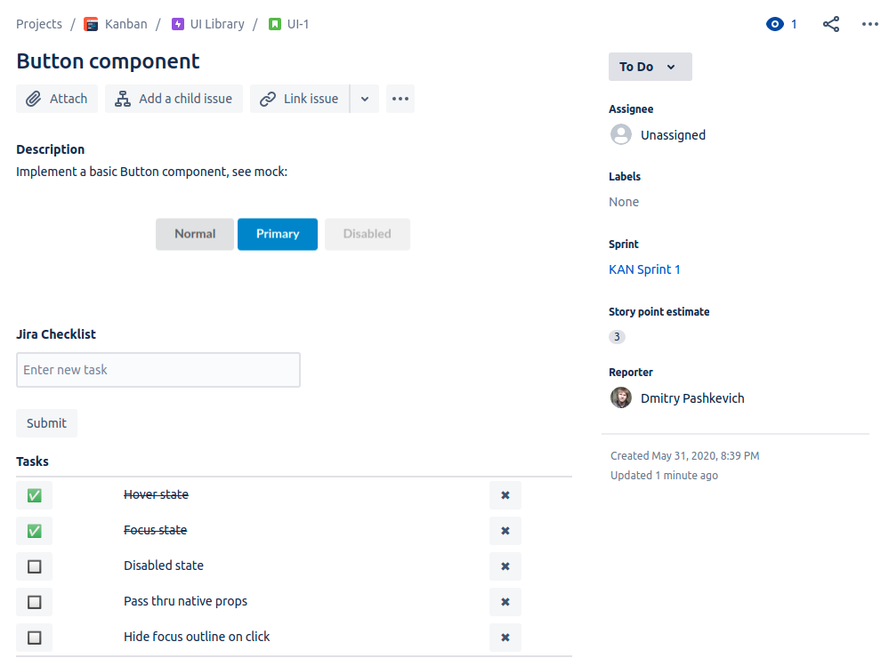

# Checklist for Jira Cloud, built with Forge

This is a demo app built with [Atlassian Forge](https://developer.atlassian.com/platform/forge) that adds a checklist panel to Jira issues. The app shows off some platform capabilities and is intended to be used as educational material.



Forge is Atlassian's new hosted Functions-as-a-Service platform. You can write functions in a subset of Node within the context of Confluence and Jira and return React-like UI components.

## Features
* Create, check/uncheck and delete list items
* Simple concurrency handling, when multiple people are modifying the same list

## Limitations
* The current [Forge UI components](https://developer.atlassian.com/platform/forge/ui-components/) have limited configuration options, particularly around layout and user event handling
* The UI actions have noticeable latency, even in production mode

## Quick start
* [Set up Forge](https://developer.atlassian.com/platform/forge/set-up-forge/) (request Beta access [here](https://www.atlassian.com/forge))

* Build and deploy the app by running:
```
forge deploy
```

* Install the app in a Jira Cloud site by running:
```
forge install
```

* To proxy app invocations to your development local environment:
```
forge tunnel
```

## Architecture

The app implements a simple UI that contains a [Form](https://developer.atlassian.com/platform/forge/ui-components/form/) with a [TextField](https://developer.atlassian.com/platform/forge/ui-components/form/#textfield) for new item entry and a [Table](https://developer.atlassian.com/platform/forge/ui-components/table/) component to render the list (this is currently the only way to render buttons and text on one line).

The state of the list is stored as JSON in the [Issue Property](https://developer.atlassian.com/cloud/jira/platform/jira-entity-properties/) using the [useIssueProperty](https://developer.atlassian.com/platform/forge/ui-hooks-reference/#useissueproperty) hook.

To support concurrency, the app:
* Assigns unique ids on checklist items
* Reloads the list before each modification

### Project directory overview
* `manifest.yml` - A Forge app manifest that defines two modules:
  * A [jira:issuePanel](https://developer.atlassian.com/platform/forge/manifest-reference/#jira-issue-panel) module.
  * A corresponding [function module](https://developer.atlassian.com/platform/forge/manifest-reference/#function) that implements the issue panel logic.
 * `src/`
   * `index.jsx` - app's entry point
   * `components/` - UI components
   * `hooks/` - custom React-like hooks

### Forge features used
The app uses the following Forge platform functionality:
* UI components
  * [IssuePanel]([https://developer.atlassian.com/platform/forge/ui-components/issue-panel/](https://developer.atlassian.com/platform/forge/ui-components/issue-panel/))
  * [Text](https://developer.atlassian.com/platform/forge/ui-components/text)
  * [Button](https://developer.atlassian.com/platform/forge/ui-components/button)
  * [Form](https://developer.atlassian.com/platform/forge/ui-components/form/)
    * [TextField](https://developer.atlassian.com/platform/forge/ui-components/form/#textfield)
  * [Table](https://developer.atlassian.com/platform/forge/ui-components/table/)
* UI hooks
  * [useState](https://developer.atlassian.com/platform/forge/ui-hooks-reference/#usestate)
  * [useIssueProperty](https://developer.atlassian.com/platform/forge/ui-hooks-reference/#useissueproperty)
